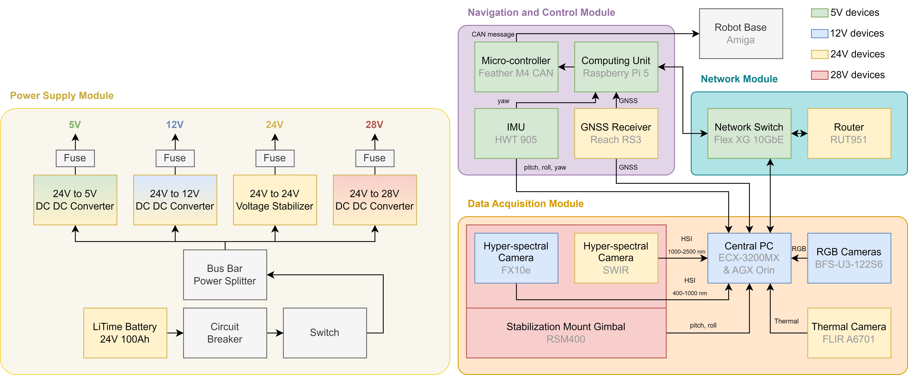

# PPB-NG

Last updated by [Yiyuan Lin](yl3663@cornell.edu) on Mar 12, 2026

**The PPB-NG codebase is currently under construction. Please stay tuned for updates.**

## PPB-NG Modular Design

## PPB-NG Navigation

The PPB-NG robot uses the same navigation codebase as PPBv2. For implementation details, please refer to [PPBv2](https://github.com/YiyuanLinXX/PPBv2).

**Note: The navigation codebase will be further upgraded and publicly released by June 2026.**

## Maintenance

For any questions or uncertainty, please contact Yiyuan Lin ([yl3663@cornell.edu](mailto:yl3663@cornell.edu)).
