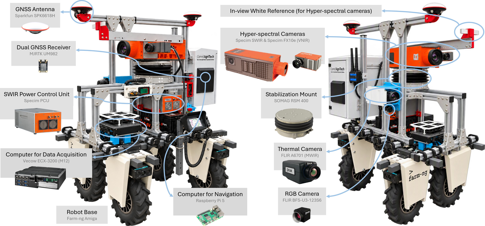
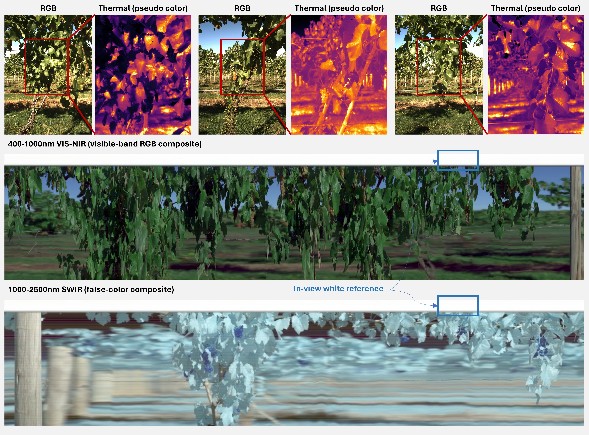
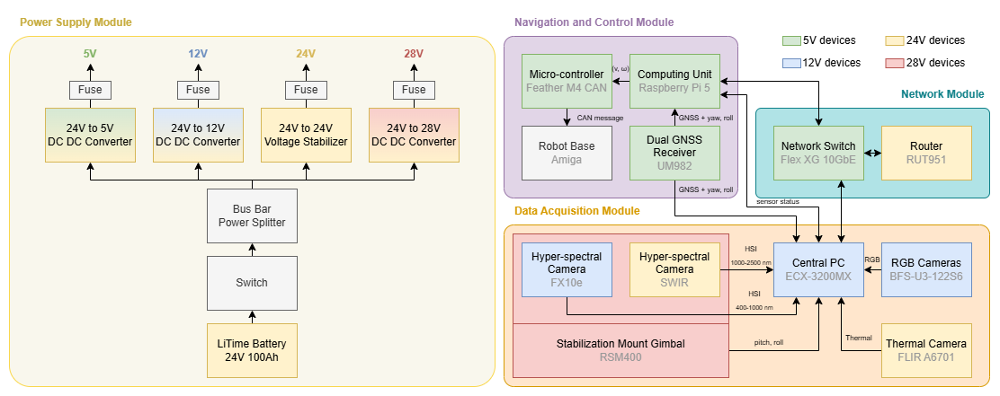

# PPB-NG

Last updated by [Yiyuan Lin](mailto:yl3663@cornell.edu) on October 7, 2026

[[**`Project Page`**](https://yiyuanlinxx.github.io/robots/ppbng)] [[**`Paper (Robot Navigation)`**](https://doi.org/10.48550/arXiv.2609.28933)] [[**`Citation`**](#citation)]

---

This repository includes the navigation and acquisition codebase for PhytoPatholoBot Next Generation (PPB-NG), a field phenotyping robot that combines hyperspectral, RGB, and thermal imaging with GNSS and stabilization-platform telemetry. The acquisition stack runs on a Windows computer with ROS 2 Jazzy, recording raw sensor data and the metadata needed to associate images with position, platform attitude, and timing evidence. Navigation and base safety run separately on the Raspberry Pi.

 For more details about PPB-NG, please visit https://yiyuanlinxx.github.io/robots/ppbng.



## Operation Manual

For configuration, building, guided dark-reference capture, field acquisition, safe shutdown, and dataset verification, see the [PPB-NG Operation Manual](OPERATION_MANUAL.md). For offline image conversion and hyperspectral visualization, see the [Data Export Guide](PPBNG_Imaging/docs/DATA_EXPORT.md). For reference, you can also find our [Internal Operation Manual](docs/PPBNG_Operation_Manual.pdf) to learn understand we deploy the robot in the field.

## PPB-NG Sensor System

| Component | Role | Implementation |
| --- | --- | --- |
| Specim FX10e and SWIR | Continuous line-scan hyperspectral acquisition with internal camera timing | [HSI](PPBNG_Imaging/src/ppbng_hsi/README_SPECSENSOR.md) |
| FLIR Blackfly S BFS-U3-122S6C-C | Raw Bayer RGB imaging | [RGB](PPBNG_Imaging/src/ppbng_rgb/README.md) |
| FLIR A6701 | Radiometric thermal payloads, calibration metadata, and NUC status | [Thermal](PPBNG_Imaging/src/ppbng_thermal/README.md) |
| Arduino UNO R4 WiFi | Shared 2 Hz external triggering for RGB and thermal cameras | [Trigger firmware and wiring](PPBNG_Imaging/firmware/arduino_uno_r4_rgb_thermal_trigger/README.md) |
| UM982 dual-antenna GNSS | Receive-only position and heading observations | [GNSS](PPBNG_Imaging/src/ppbng_gnss/README_PRODUCTION_NODE.md) |
| SOMAG RSM400 | Stabilization-platform telemetry | [RSM400](PPBNG_Imaging/src/ppbng_rsm400/README.md) |

The HSI cameras use their own continuous timing and do not share the RGB/thermal trigger. The supplied configuration operates without PPS; host-time association does not establish precise exposure-time UTC synchronization. RSM400 attitude describes its platform, not the robot chassis or independently mounted RGB/thermal cameras.

## PPB-NG Multi-Modal Sample Data



## PPB-NG Modular Design



## Repository Layout

- [`PPBNG_Navigation/`](PPBNG_Navigation/README.md): Raspberry Pi ROS 2 waypoint navigation, dual-antenna UM982 GNSS, base control, and acquisition-state motion interlock.
- [`PPBNG_Imaging/`](PPBNG_Imaging/README.md): Windows ROS 2 acquisition workspace, including `src/`, `tools/`, `firmware/`, and data export documentation in `docs/`.
- `docs/`: shared robot documentation, including the internal operation manual.
- `OPERATION_MANUAL.md`: setup and operating procedures.

## PPB-NG Navigation

The navigation stack runs on a Raspberry Pi 5 with Ubuntu 24.04 and ROS 2 Jazzy. It uses a dual-antenna UM982 receiver for RTK position and true heading without a separate IMU, and supports PID line tracking, pure pursuit, MPC, and a hybrid row-navigation controller. An Adafruit Feather M4 CAN microcontroller connects the navigation stack to the Farm-ng Amiga base.

During automatic navigation, the stack monitors acquisition health through the Windows computer's motion-permission signal. If a required camera is not acquiring normally, the thermal camera enters automatic non-uniformity correction (NUC), or permission messages time out, navigation requests a stop and waits for permission to return.

See the [Navigation README](PPBNG_Navigation/README.md) for setup, waypoint recording, controller configuration, recovery behavior, and manual-override limits. For navigation without acquisition-state monitoring, refer to [PPBv2 Navigation](https://github.com/YiyuanLinXX/PPBv2/tree/main/PPBv2_Navigation).

## Software and Configuration

The Windows acquisition workspace in `PPBNG_Imaging/` contains 11 ROS 2 packages covering sensor interfaces, timing, storage, acquisition management, and launch configuration. Production builds use Visual Studio 2019 x64, ROS 2 Jazzy, Spinnaker, SpecSensor, and the required Pleora/NI drivers. Vendor SDKs, licenses, and camera calibration packs are not included.

Edit [ppbng_config.yaml](PPBNG_Imaging/src/ppbng_bringup/config/ppbng_config.yaml) before deployment. The supplied configuration retains the original robot's device identities, COM ports, network addresses, and absolute paths. Update these for the target installation, review SDK paths in the build wrappers, and qualify the destination disk before recording. See [Bringup](PPBNG_Imaging/src/ppbng_bringup/README.md) and [Configuration](PPBNG_Imaging/src/ppbng_bringup/config/README.md).

After completing the setup in the operation manual, the main Windows PowerShell commands, starting from the repository root, are:

```powershell
cd .\PPBNG_Imaging
.\tools\build_production.cmd
.\tools\test.cmd
.\tools\run_production_acquisition.cmd field_01 60
```

The acquisition command starts the guided dark-reference and recording workflow; `field_01` is the dataset name and `60` is the maximum scene duration in minutes. Follow the operator prompts and stop robot motion before stopping acquisition.

## Robot Integration

The acquisition computer publishes `/ppbng/safety/thermal_motion_permitted` for the Raspberry Pi navigation stack. Permission depends on thermal NUC state and acquisition/device health. The Pi must inhibit motion when permission is false or stale, implement an independent timeout watchdog, and retain its RTK and emergency-stop logic. Verify cross-host stop behavior before autonomous operation. Network settings and the message contract are documented in the [operation manual](OPERATION_MANUAL.md#network-and-robot-safety).

## Data Recording and Export

RGB and thermal payloads are saved in `.ppbseg` containers; hyperspectral lines are saved as ENVI BIL data with headers, indices, and timestamps. Preserve the session manifest, configuration snapshot, calibration metadata, and sidecars alongside the raw data.

The A6701 transport preserves all 640 × 513 samples, including its auxiliary first row and 640 × 512 image region. Thermal counts and false-color previews are not temperatures in Celsius. The FX10e full-export tool renders all saved lines into RGB tiles using three visible bands; these are display products, not full-spectrum reflectance or georectified imagery. See the [Data Export Guide](PPBNG_Imaging/docs/DATA_EXPORT.md) for commands and interpretation limits.

## Citation

If you find this work useful for your research, please consider citing our work:

```bibtex
# PPB-NG Navigation
@misc{lin2026fielddeployablegnssbasednavigationstack,
      title={A Field-Deployable GNSS-based Navigation Stack for Outdoor Mobile Robots}, 
      author={Yiyuan Lin and Cole Regnier and Yu Jiang},
      year={2026},
      eprint={2609.28933},
      archivePrefix={arXiv},
      primaryClass={cs.RO},
      url={https://arxiv.org/abs/2609.28933}, 
      doi={https://doi.org/10.48550/arXiv.2609.28933},
}

# PPB-NG
Citation information will be updated upon publication.
```

## License

This project is licensed under the [Apache License 2.0](LICENSE). Third-party SDKs and calibration materials remain subject to their own licenses.

## Maintenance

For questions, please contact Yiyuan Lin ([yl3663@cornell.edu](mailto:yl3663@cornell.edu)).
